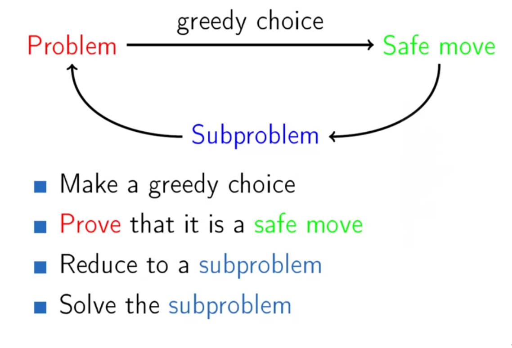
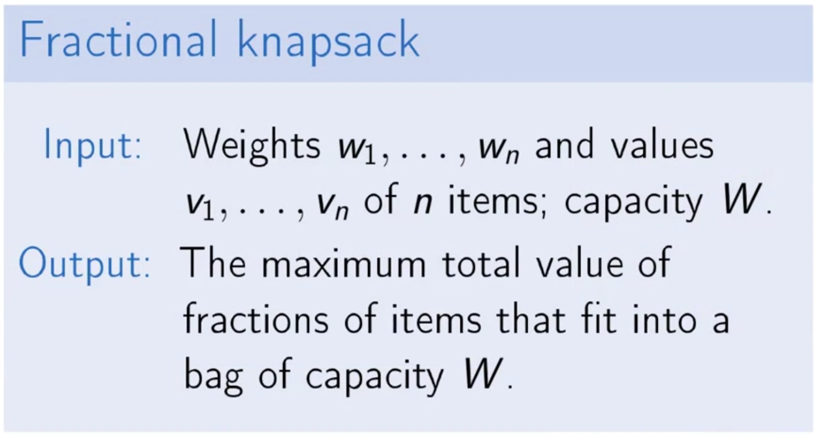
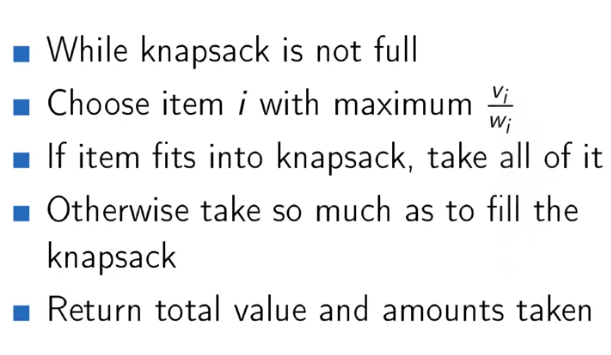
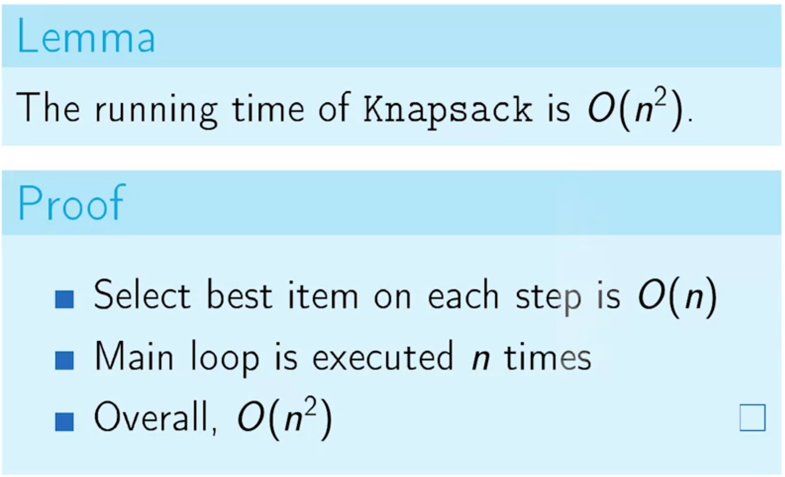
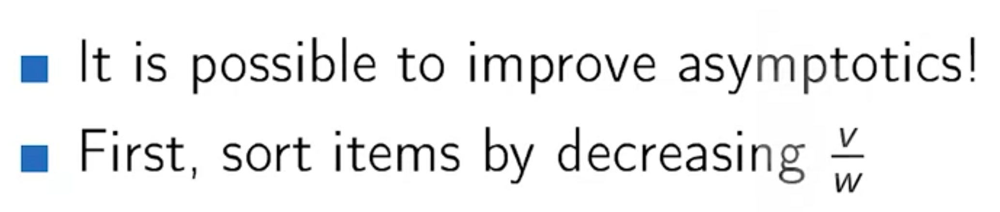
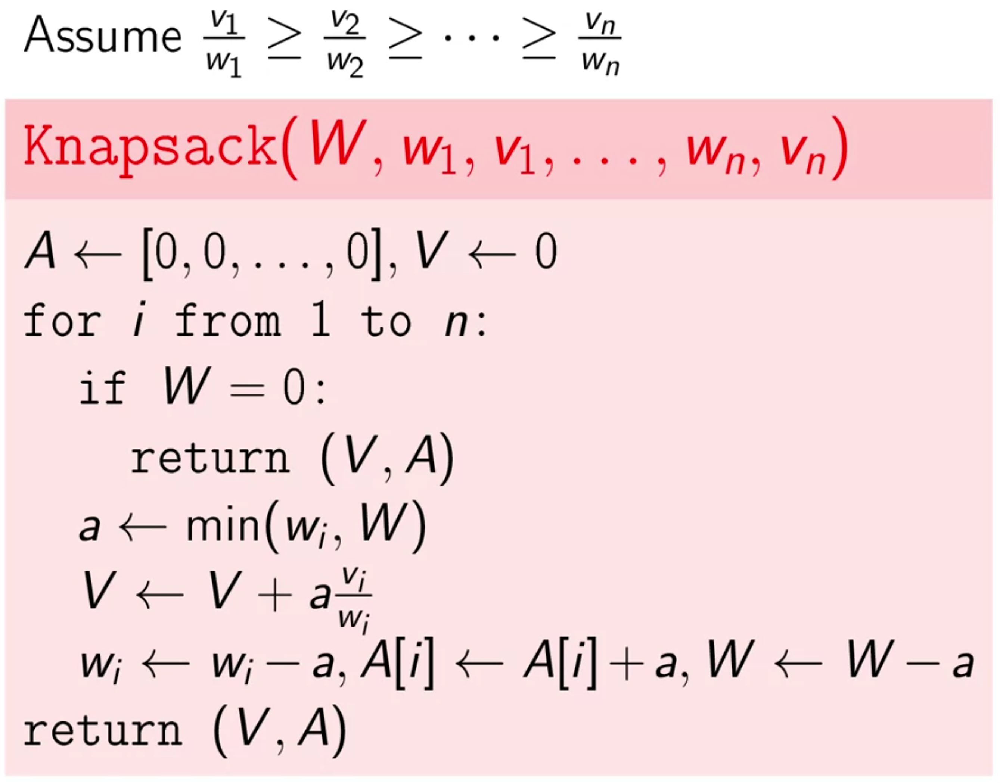

# Greedy Algorithms

Greedy algorithms are *greedy*. They don't look into the future to choose the **global** *optimal solution*. They are only interested in **optimal solution locally**.

## Main ingredients

At each iteration, we are solving one step of the problem, this approach is called *subproblem*.

Another important term is the **safe move**. We call a **greedy** choice a **safe move** if it is consistent with some optimal solution.

General Strategy:

1. Make a greedy choice

2. Prove that it is a safe move

3. Reduce the problem to a subproblem.

4. Solve the subproblem.

   

## Problems

### Largest number

> As the last question of a successful interview, your boss gives you a few pieces of paper with numbers on it and asks you to compose a largest number from these numbers. The resulting number is going to be your salary, so you are very much interested in maximizing this number. How can you do this?

### Minimum refuel problem

> You are going to travel to another city that is located 𝑑 miles away from your home city. Your car can travel at most 𝑚 miles on a full tank and you start with a full tank. Along your way, there are gas stations at distances stop 1 , stop 2 , . . . , stop 𝑛 from your home city. What is the minimum number of refills needed?

### Celebration party problem

> Let's consider the following situation. You've invited a lot of  children to a celebration party, and you want to entertain them and also  teach them something in the process. You are going to hire a few  teachers and divide the children into groups and assign a teacher to  each of the groups. This teacher will work with this group through the  whole party. 
>
> But you know that for a teacher to work with a group of children  efficiently children of that group should be of relatively the same age.  More specifically age of any two children in the same group should  differ by at most, one year. 
>
> Also, you want to minimize the number of groups. Because you want  to hire fewer teachers, and spend the money on presents and other kinds  of entertainment for the children. So, you need to divide children into  the minimum possible number of groups. Such that the age of any two children in any group differs by at most one year.

Naive solution would be to check all grouping options, as each children can be included or excluded, the time complexity is $$\Omega(2^n)$$.

The efficient algorithm is to represent each children as a point on x axis, sort them and then split data into a group of points with at most one unit difference. The time complexity of this approach is **O(n)**, thought this is when we don't consider the sorting cost which is **O(`nlogn`)**.

### Fractional Knapsack

> Given weights and values of n items, we need to put these items in a knapsack of capacity **W** to get the maximum total value in the knapsack.

#### Naive approach

* Time complexity of this approach:

* Efficient way to solve it:

## Useful links

[Greedy Algorithms In Python](https://skerritt.blog/greedy-algorithms/)
