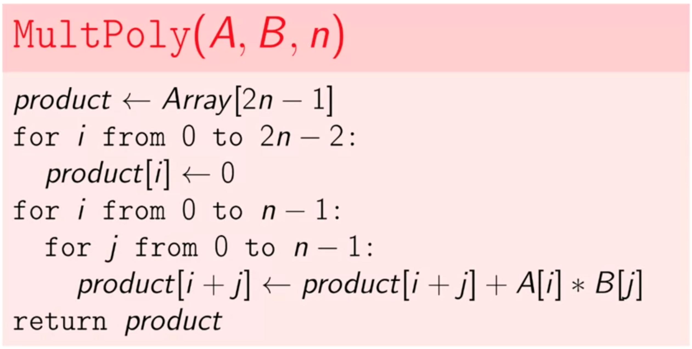
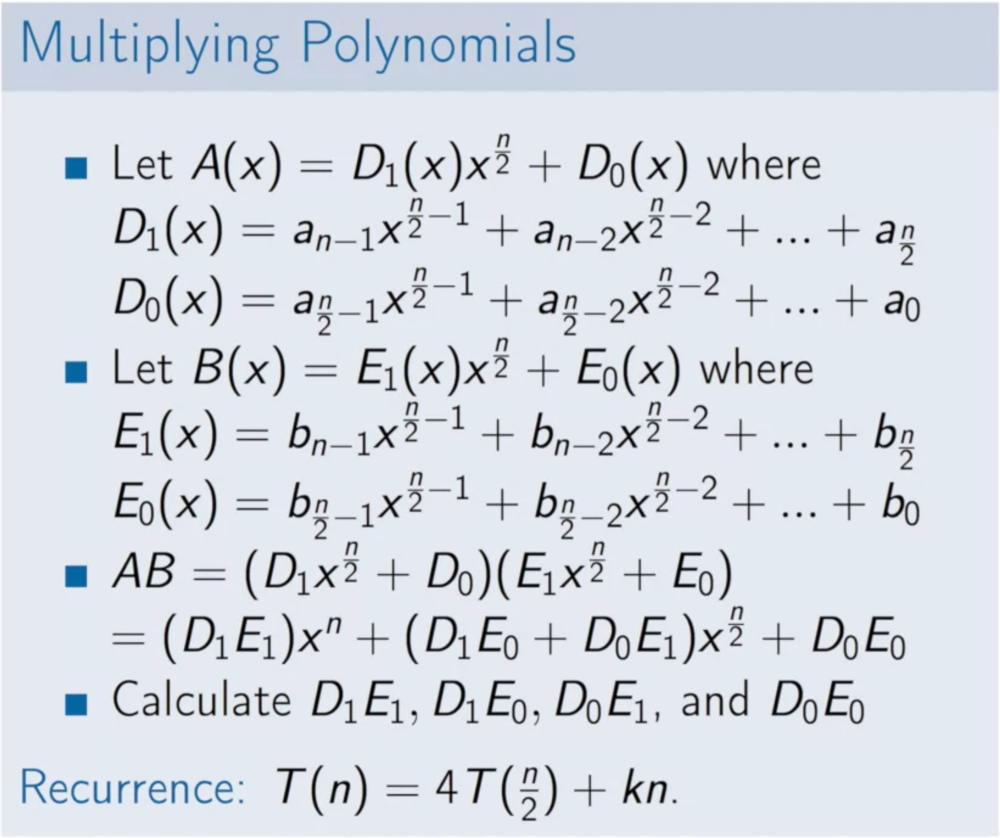
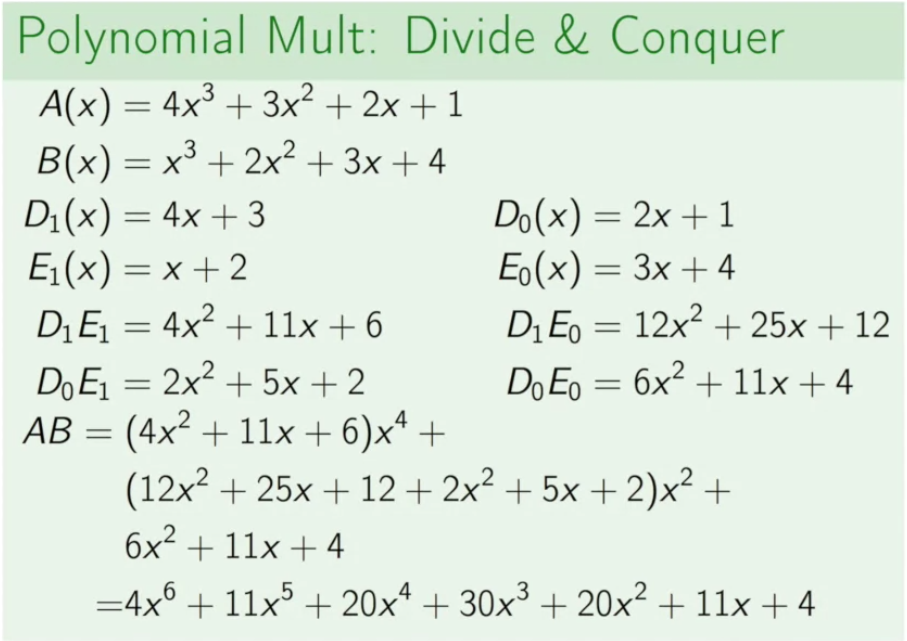
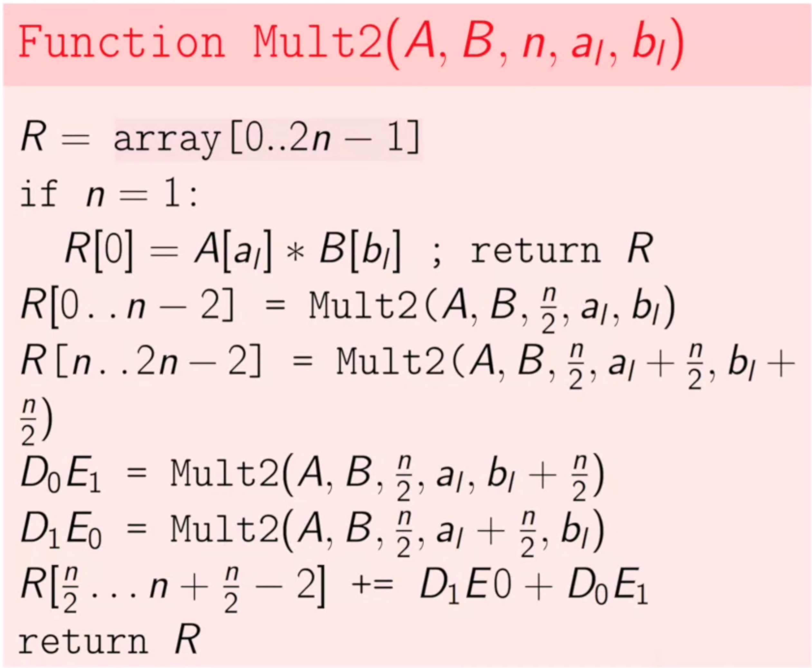
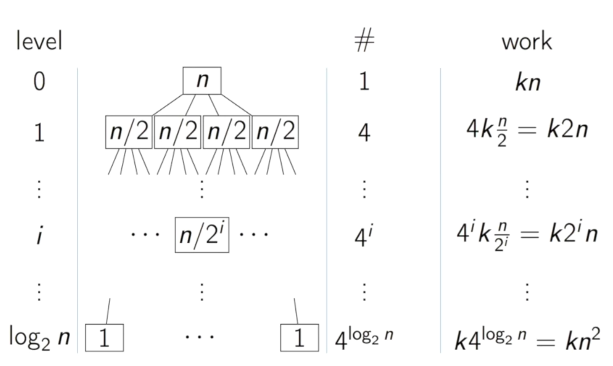

# Dividing and Conquer

The idea of divide and conquer is to split the main problem into some subproblems and solve them instead of a large problem. Break the problem into non-overlapping subproblems of the same type, and at the end combine different parts.

## Introduction

## Problems

### Polynomial Multiplication

#### Naive algorithm

#### Naive divide and conquer algorithm

What if you divide a multiplication into four parallel parts:

Example:

Implementation:

Time complexity of this algorithm is the same as the naive algorithm **O(n^2)**.

#### Efficient divide and conquer algorithm