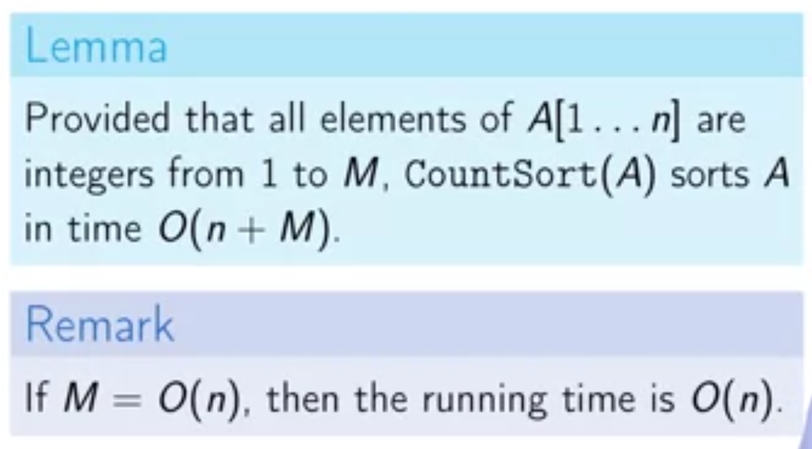
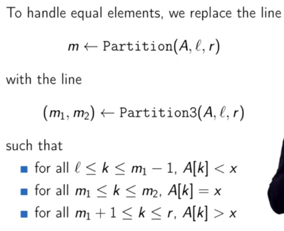

Dividing and Conquer

The idea of divide and conquer is to split the main problem into some subproblems and solve them instead of a large problem. Break the problem into non-overlapping subproblems of the same type, and at the end combine different parts.

## Introduction

## Problems

### Polynomial Multiplication

#### Naive algorithm

#### Naive divide and conquer algorithm

What if you divide a multiplication into four parallel parts:

Example:

Implementation:

Time complexity of this algorithm is the same as the naive algorithm $$O(n^2)$$.

#### Efficient divide and conquer algorithm

`Karatsuba` realized in a normal multiplication we have 4 multiplication:

He rewrited the formula to have fewer multiple operations:

For example: as it can be observed we have only 3 multiplication, instead of 4. This can reduce the time complexity of the algorithm significantly.

Time Complexity:

## Master Theorem

Master theorem helps us to identify the time complexity of a divide-and-conquer algorithm more easily, instead of creating the recurrence tree we can simply recognize it.

## Sorting Problem

We want to sort data as it is an essential step of efficient algorithms and it also allows more efficient queries (like binary search).

### Selection Sort

Selection sorting algorithm is pretty straightforward, at $$i^{th}$$ step, it will find the $$i^{th}$$ minimum element and put it in the right place.

This is an example code about how to implement it:

The running time of selection sort is $$O(n^2)$$, as it has two for loop and it works like an arithmetic series, and the running time of this algorithm does not depend on the input data. It only depends on the size of the input data.

### Merge Sort

https://brilliant.org/wiki/merge/

Merge sort has two steps: merging and sorting. Merge sort focuses on how to merge two pre-sorted arrays such that the resulting array is also sorted.

The merge part works like this:

> 1. Create an empty list called the result list.   
> 2. Do the following until one of the input lists is empty: Remove the  first element of the list that has a lesser first element and append it  to the result list.   
> 3. When one of the lists is empty, append all elements of the other list to the result.

Merge sort runs in $$O(n\lg n)$$ time in its best case, worst case, and average case. That means that no matter what the input, merge sort will operate in $$O(n \lg n)$$ time. But it is not as space-efficient as other sorting algorithms, it uses a [space complexity](https://brilliant.org/wiki/space-complexity/) of $$O(n)$$.

#### Lower Bound

Here we are trying to prove that there is a Lower bound for comparison based algorithm and merge sort reaches that lower band, so it is efficient.

Any comparison algorithm can be expressed as a decision tree, in which leaves are the final sorted items. The number of leaves ($$l$$) in the tree must be at least $$n!$$ (the total number of permutations).

 And we know the maximum number of leaves in the tree with depth $$d$$ is $$2^{d}$$. And $$2^d \ge l$$  or $$d \ge \lg_2 l$$.

### Counting Sort

Counting sort algorithm is a non-comparison algorithm and we want to show that in this case our lower bound might not apply.

* While any comparison based sorting algorithm requires $$\Omega(n \lg n)$$ comparisons, counting sort has a running time of $$\Theta(n)$$ when the length of the input list is not much smaller than the largest key value, $$k$$, in the list.

  

https://brilliant.org/wiki/counting-sort/

https://codereview.stackexchange.com/questions/105490/counting-sort-in-python

Summary

### Quick Sort

* Comparison based
* running time: $$O(n \lg n)$$, (on average)
* efficient in practice

It will pick a pivot and it will arrange items in way that pivot will be placed in its final position, and all the elements before it are lower or equal to the pivot and all of items on the right are bigger than the pivot.

What's remain to be done, is the left and right side of the pivot item. We could do by two recursive calls.

But, how does the partition function work?

If we in each iteration choose the minimum element then we compare this element with all other element, image we're doing this for all iteration (this case is called **unbalanced partition**):
$$
T(n) = n + T(n-1): \\
T(n) = n + n -1 + n-2 + \dots = \Theta(n^2)
$$
Unbalanced partition, with any degree, always leads to $$\Theta(n^2)$$ running time. But if we could somehow find a partition that split the array into two halves (**balanced partition**):
$$
T(n) = 2T(\frac{n}{2}) + n \\
T(n) = \Theta(n \lg n)
$$
Balanced partitions are better, as they reduce the number of comparisons.

So, finding a good pivot is the most important aspect of quick sort (even if this pivot does not split it equivalently it is still $$\Theta(n \lg n)$$). From the mathematical point of view, this element should the the median of the array. But what if we choose the pivot randomly:

Why random pivot?

Image we an array of items called A, and each element is unique inside the list, if we sort this array, then we expect the $$\frac{n}{2}$$ of item be placed in the center of the sorted array, the remaining $$2\frac{n}{4}$$ be smaller and greater, respectively of the centered items. **So half of the elements of A guarantees a balanced partition.**

##### Equal elements

If we have some repetition inside our list, then when we pick a pivot all other repeated one will be sorted as well, and we should take this into consideration to don't use any of repeated ones again. As result, quick sort is not as fast as merge sort on a dataset with a few unique elements. On this case the running time is $$\Theta(n^2)$$. This is true even for pre-sorted arrays.

To handle equal elements we could change our partition algorithm to split the data after choosing a pivot into three region.

With this simple modification, `Partition3`, quick sorting algorithm is now faster than merge sort on dataset with few unique elements.

* Up to now, we only implemented this algorithm recursively and it might use too much of stack resources, **it uses $$O(n)$$ additional memory**. One way to remedy this is to reduce the recursive calls to one and in this case uses **no more than $$O(\log n)$$ additional memory**.

Here, we don't care about which side is shorter, while we have the option to decide first which side we want to sort:

And finally, as we don't have control over to how select pivot in this approach, it is randomized, we can go for another approach which is more deterministic. For instance, we can use the median-of-medians algorithm to always choose the median of dataset.

https://stackabuse.com/quicksort-in-python/

https://brilliant.org/wiki/quick-sort/