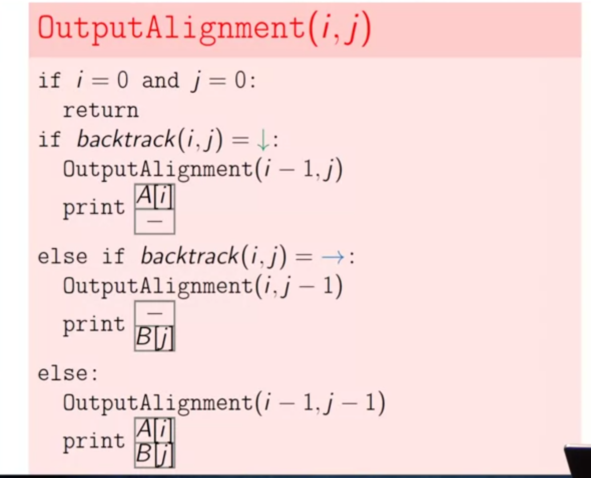

# Dynamic Programming

In the change problem that we solved in the third week, using the Greedy algorithm, in some situations greedy approach does not find the optimal answer. Consider this case:

```python
# You have to take back 40 cents
# Cashier has these coins: 25, 20, 10, 5
# It will return 25, 10, 5; while it could have returned 2 20 coins.
```

It is possible to solve this problem by combination of recursive approach:

* Imagine the denominations are: 6, 5, 1.

* What is the minimum number of coins to change 9 cents?

  ```python
  min_num_coins(9) = min(min_num_coins(9 - 6), min_num_coins(9 - 5), min_num_coins(1)) + 1
  ```

It seems pretty rationale, but how fast is the recursive approach?


The depth of this very **huge** and there is **redundancy** as well. We are going to solve these problems using **Dynamic Programming**.


Here the idea is, instead of going from right to left (i.e. recursive approach), we go from left to right. Firstly we calculate the lower amounts, so we don't need the recursive calls, by the time we reach to n we can easily detect the optimal solution.

## Introduction

In dynamic programming, our goal is to break the main problem into **subproblems** and save the result of each subproblem (**memoization**) and then re-use that  pre-calculated value:
$$
DP = Guessing + Recursion + Memoization
$$

$$
time = \#subproblems * \frac{time}{subproblem}
$$

Don't count the memoized recursions, you just do it one time and use other time.

* Subproblems dependencies should be **acyclic**, otherwise you cannot use the recursion.

There are two main approaches in dynamic programming:

1. **Top-down** approach: we use recursion here.
2. **Bottom-up**: We try to minimize the recursion using the Memoization technique. 

## Problems

### Fibonacci Series

We are trying to say you only need the two previous value in this implementation to have the answer.

```python
memo = {0: 0, 1: 1, 2: 2}

def fib(n: int):
    """This implementation uses O(n) space, as we save all Fibonacci series inside the mapping object."""
    if n not in memo:
    	memo[n] = fib(n - 1) + fib(n - 2)
    return memo[n]

# In the below implementation, we can reduce the space complexity to a constant by only holding the last two values, as we are going from bottom to up we don't the old values in the future.
memo = {}

for k in range(1, n + 1):
    if k <= 2:
        value = k
    else:
        value = memo[k - 1] + memo[k - 2]
    memo[k] = value
memo[n]

```

### Edit Distance

In this problem, we are looking for the **minimum number of operations** (includes insertion, deletion, and substitutions) **to transform one string into another**.

The instructor gave an awful speech about this one, if you one to learn more you can watch this [Youtube](https://www.youtube.com/watch?v=We3YDTzNXEk) video.


Basically, we are doing a dynamic program by getting the minimum of different strategies:
$$
\Big\{min(D(i, j - 1) + 1, D(i - 1, j) + 1, D(i-1, j-1) + 1, D(i - 1, j - 1)
$$
And at the end we have **a filled matrix**, if we start from **the end** of this matrix, we can find the minimum edit distance.




### Longest common subsequence of two sequences

### Coin Change

### Primitive Calculator