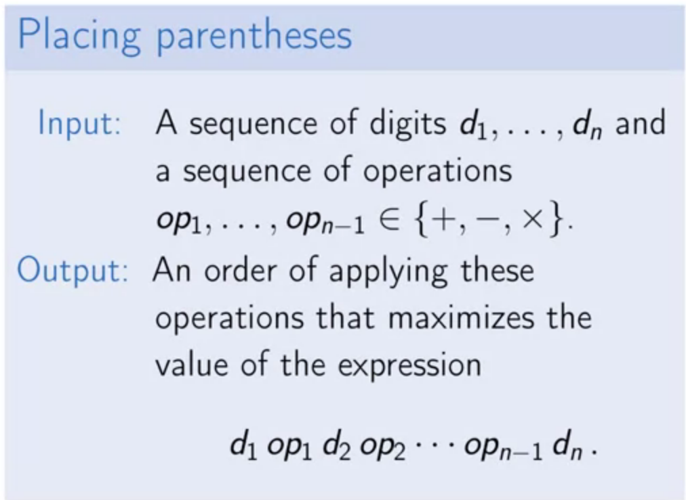
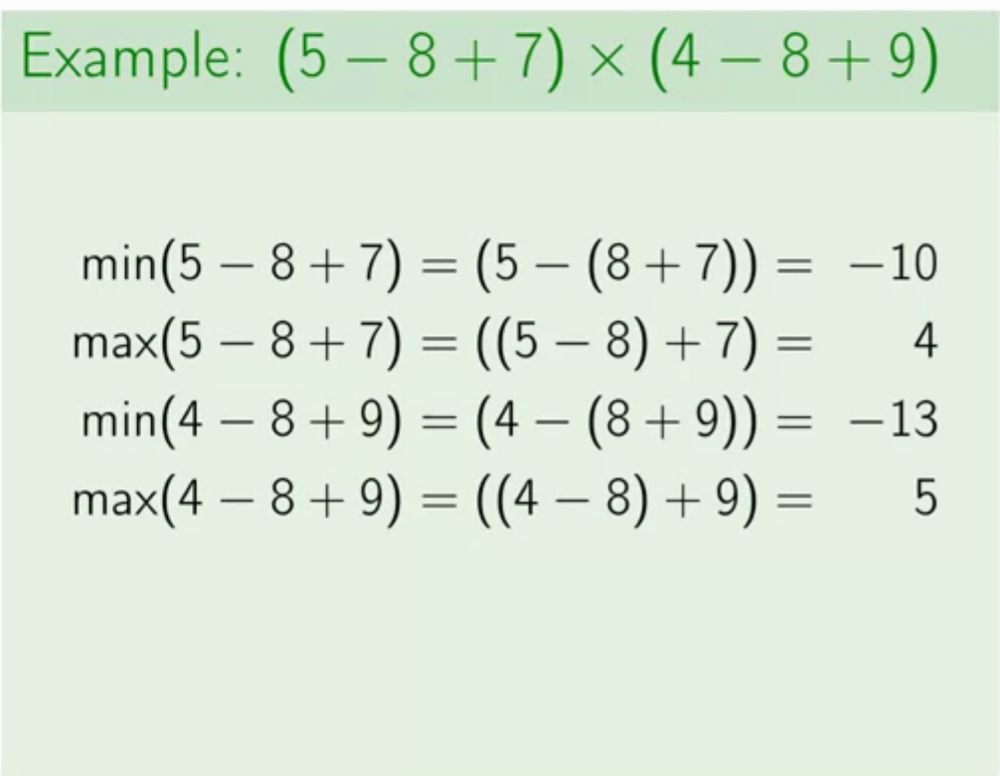
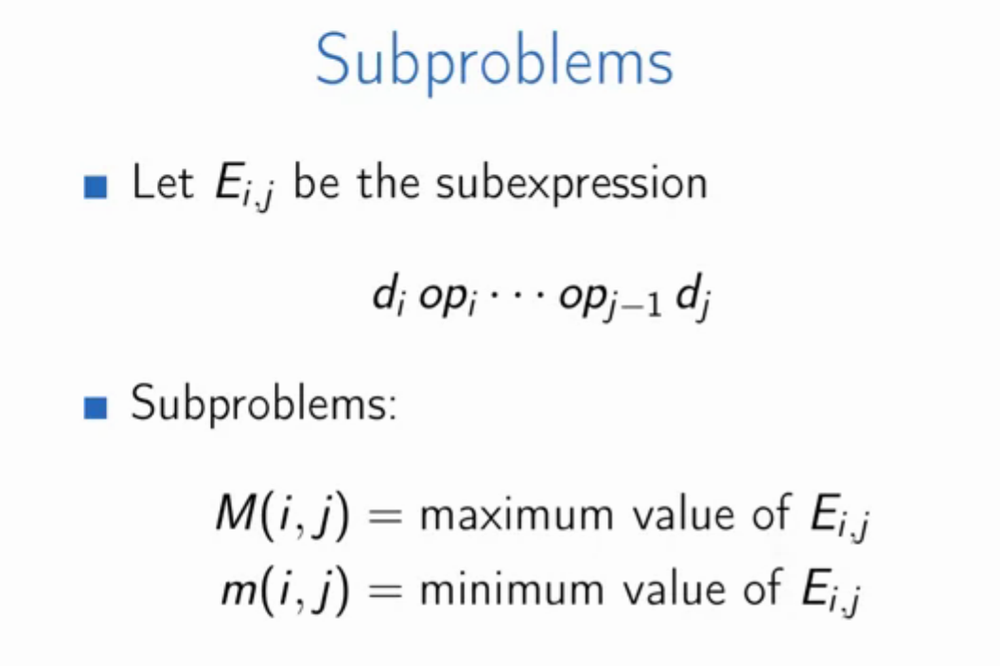
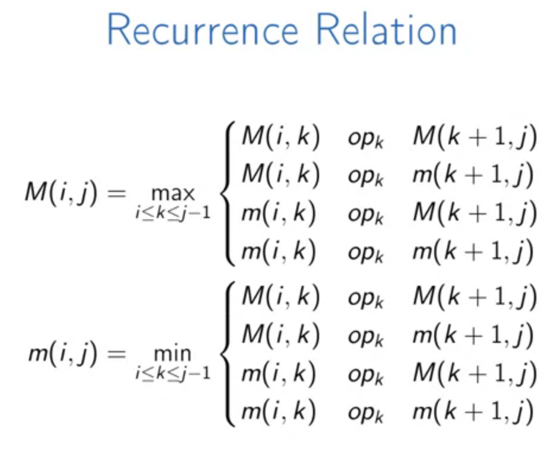
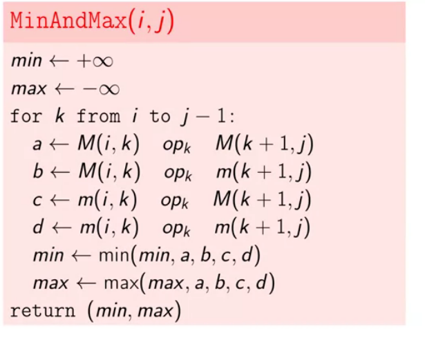
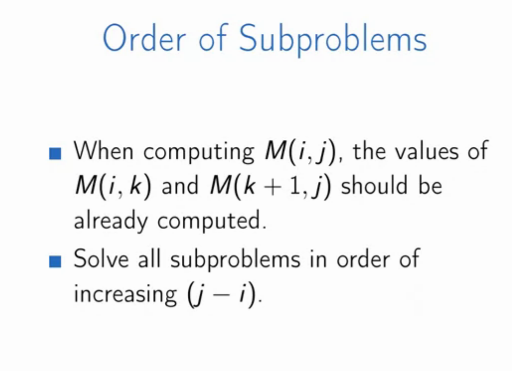
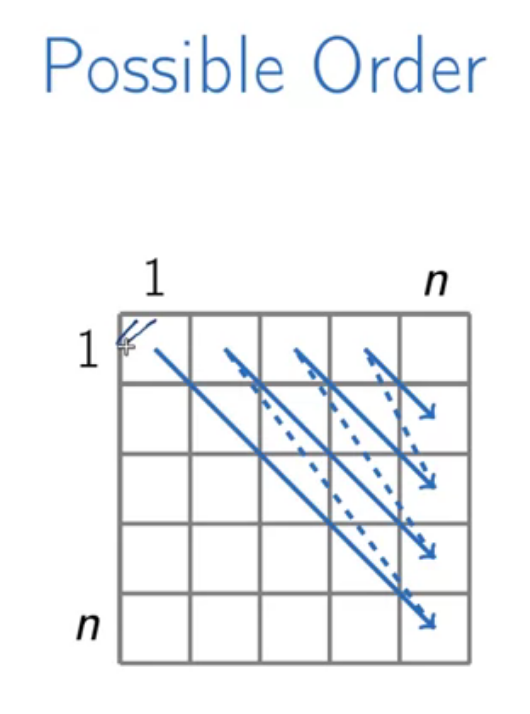
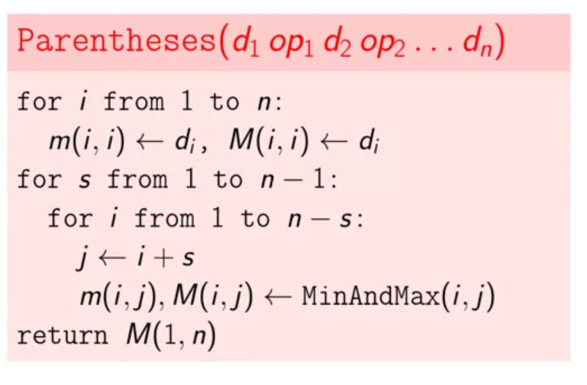
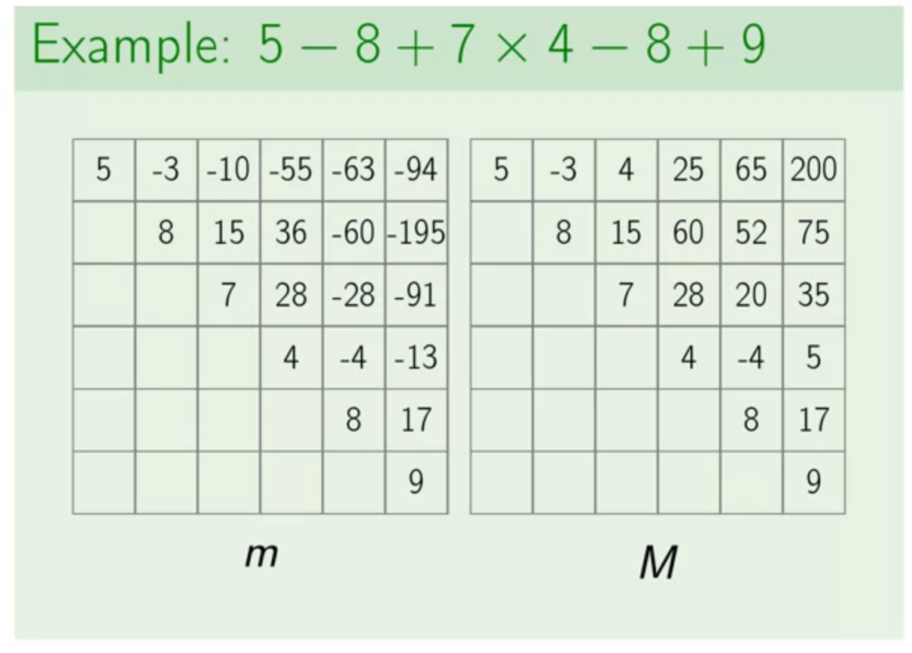

# Dynamic Programming II

## Problems

### Knapsack

As you might remember we solved knapsack problem using Greedy approach in the past, it was an optimal solution when you could choose fractionally from items. But when we are dealing with zero/one Knapsack, it cannot find the optimal solution.

[Bottom up solution](https://www.youtube.com/watch?v=8LusJS5-AGo), [top-down solution](https://www.youtube.com/watch?v=xOlhR_2QCXY).

#### Knapsack With Repetitions

#### Knapsack without Repetitions

The i-th value is either used or not, and we calculate both cases at each step.
$$
max\{value(W - w_i, i - 1), value(W, i - 1)\}
$$

### Placing Parentheses

Our goal is to parentheses a given expression in a such way that **maximizes** the value of that expression. Valid operations are `+`, `-`, and `*`.

Calculating this problem using a naive approach leads to an exponentially:
$$
\Theta(op!)
$$
We'll design an efficient dynamic programming algorithm to find a more tractable algorithm. The intuition behind this approach is that we assume that we know the last operation which is optimal by the way. so we can break the expression with the last operation in mind. Now, we should look for optimal values for sub-expressions. However, we need to keep track of both **minimal and maximal** values of subexpressions!

So, in order to be able to solve this problem we need to solve these subproblems:

Now for $$E_i,_j$$ we want to compute both extreme ends, there is a last operation that we call it $$op_k$$ which splits our initial subexpression into two sub-expressions. To compute Maximum and minimum we have to the following operations:

* We save the result of this algorithm inside a squared matrix ($$n*n$$, n is the number of digits).

* We use two different table for storing values, one for minimum values and other one for the maximum values.

It takes $$O(n^3)$$, as the `MinAndMax` takes $$j-i$$ which is equal to $$n$$. 

For example imagine the expression is $$5−8+7×4−8+9$$.

#### Reconstructing a solution

[Link on Coursera](https://www.coursera.org/learn/algorithmic-toolbox/lecture/gBEUe/reconstructing-a-solution)

