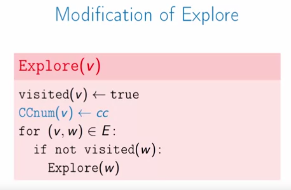

## Graph Basics

Graphs are abstractions to **represent connection between objects**. You can represent many things using graphs:

* Network Connection
* Maps
* Social Networks

**Definition**

An undirected Graph is a collection of $V$ of vertices, and a collection of $E$ of edges each of which connects a pair vertices.

* We could have multiple edges between same vertices or a loop connects a vertex to itself. If a graph has neither is called **simple graph**.

**Graph Representation**

So far, we said a graph is consisted of a bunch of vertices (nodes), and also a couple of edges which connect these vertices. There are many ways to represent graphs and different ways have different computation cost.

**Edge List**: we store a list of edges

**Adjacency Matrix**: Entries 1 if there is an edge, 0 if there is not.

**Adjacency List**: For each vertex, store a list of adjacent vertices.

**Summary**

Different operations are faster in different representations.

* For many problems, want **adjacency list**.

**Graph algorithms runtime**

* Runtime depends on $|V|$ and $|E|$, $(|V| + |E|)$ is considered linear time.
* So, it really depends on the density of graph

## Exploring Undirected Graphs

This notion of exploring a graph has many applications:

* Finding routes
* Ensuring connectivity
* Solving puzzles and mazes

**Exploring Graphs**

Find all nodes that are reachable from a given vertex:

We could use Depth First Ordering to find all of them.

We need Adjacency list for our graph to our program work. $E$ is all vertices that are connected via edges to the vertex $v$. Runtime for this algorithm is $O(|E|)$ as we visit all adjacent vertexes of $v$.

* What if we want to find all vertices of graph $G$, not just those that are reachable from vertex $v$.

Runtime of this algorithm:

* First we find a vertex and explore of its edges: $(|V| + |E|)$.

**Connectivity**

We want to find out which vertices are connected, for a undirected graph we can partition it into multiple *Connected Components* so that $v$ is reachable from $w$ if and only if they are in the same connected component.

So, we change the problem into find the connected components of a given graph G:

It turns out we can achieve this goal using previously defined explore function, by a simple modification that we add a label, or a number, to a vertices inside the same connected components.

The runtime of this algorithm is $O(|V| + |E|)$.

**Pre-visit and Post-visit orderings**

We want to augment functions to store additional information.

An example of their usage:

