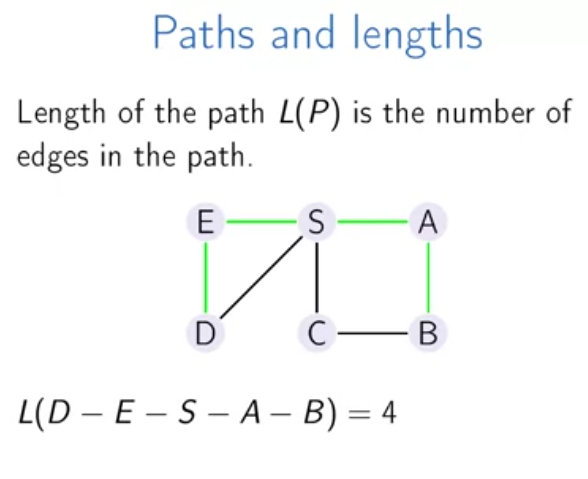

# Week 3

## Paths in graphs 1

### Paths and distances

What is the minimum number of flight segments to get from Hamburg to Moscow?

Finding shortest path from a starting point

We can use a simpler representation to do this task, which is called distance layers:

### Breadth-first Search

We process the graph layer by layer

### Implementation and Analysis

