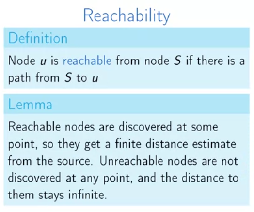

# Week 3

## Paths in graphs 1

### Paths and distances

What is the minimum number of flight segments to get from Hamburg to Moscow?

Finding shortest path from a starting point

We can use a simpler representation to do this task, which is called distance layers:

### Breadth-first Search

We process the graph layer by layer.

* We can use BFS to find the shortest path when the graph is **undirected** and **unweighted**.
* The graph should be **unweighted** because BFS does not check the weight of an edge, it will only search for the minimum segment.

### Implementation and Analysis

### Proof of Correctness

### Shortest-path Tree

* prev array/map holds the data about the parent node of $u$.

