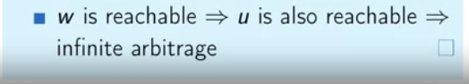

# Paths in Graphs 2

## Fastest Route

What is the problem?

We are looking for the shortest path, not the minimum number of segments which we solved this using BFS, but looking for a shortest sum of the weights.

In the below case, our BFS algorithm fails to find the optimal solution:

### Naive Algorithm

Here we assume we have a upper bound on actual distance from $S$ to $v$ and when we go further we check if going from S to v using another edge such as $u$ if this new path is shorter than our current way, then we'd update the distance array.

* Basically, we are checking whether it is possible to improve our current estimation or not.

**Dijkstra's algorithm**

* We maintain a set $R$ of vertices for which $dist$ is already set correctly ("known region").
* The first vertex added to $R$ is $S$.
* On each iteration we take a vertex outside of $R$ with minimal dist-value, add it to $R$, and relax all outgoing edges.

* Running time of this algorithm depends on what data structure you're going to use for the $H$, it would be $|V^2|$ if you go for a simple array.
* Dijkstra can find the minimum time to get from work to home.
* It works for any graph with **non-negative** edge weights. Because in every round Dijkstra will settle a node, finalize a node if you later find a negative weighed edge, this could lead to a shorter path to that settled node.
* Works in $O(|V|^2)$ or $O((|V| + |E|) log (|V|))$ (priority-queue) depending on the implementation. In the worst case $|E|=|V^2|$, so it becomes $O(|V| +|V^2| \lg{|V|})$ which equals $O(|V^2| \lg{|V|})$. In the best case there is no edges so overall cost would be $O(|V|\lg{|V|})$.
* While Dijkstra's algorithm **may fail** to find optimal path on certain graphs with negative weights, having a **negative cycle** is a bigger problem for **any** shortest path graph.
* It works for both **directed** and **undirected** graphs.

## Currency Exchange

In this part we are going to learn how to find the shortest path even if some of the edge weights can be negative.

Triangle arbitrage illustrates the fact that sometimes it is possible to make three trades ($USD \rightarrow EURO, EURO \rightarrow POUND, POUND \rightarrow USD$) so that you make some profit.

There might exist an infinite number of conversions:

This problem is not compatible with the shortest path one, how to reduce to shortest paths:

* replace products with **sum** by taking logarithms of weights.
* in the shortest path problem we want to minimize the distance while here we want to maximize so we **negate** weights to solve minimization instead of maximization.

**Taking the logarithm**

**Negation**

**All together**

Did we solve the problem? No, this does not exactly work.

Dijkstra's algorithm will pick 5 for S-A, while S-B-A is a better path. This example can also happen in currency exchange example:

If we take -logarithm from these vertices, it is still beneficial to go from $RUR \rightarrow EURO, EURO \rightarrow USD$, don't forget we are minimizing the currency exchange.

There might exist a negative weight cycle:

### Bellman-Ford algorithm

which is an algorithm for shortest path when edges can have negative weights.

Its benefit over Dijkstra's algorithm it works even for negative edge weights, it is a bit **slower** than Dijkstra, but covers everything.

* This algorithm assumes there **are not** negative weight cycles in $G$, otherwise it **may not** return correct distances for some of the node.

How to deal with negative cycles in graphs

* Detect and find the cycle if you know there is one.

We did $|V| - 1$ iteration in Bellman-Ford algorithm, so if you run one more iteration and the distances change then we realize that there is a negative weight cycle.

This proof says even if there is a cycle (non-negative) more iteration does not result in changing distances. Because it is positive and we are looking for shortest path and that cycle can be removed.

​																	

Second proof says imagine there is a negative cycle but it won't result in relaxation (contradiction):

This summation says it is positive while we know that this is a negative cycle, so this is a contradiction.

If we know there is a negative cycle, we want to find it, at least one of them:

### Infinite Arbitrage

How to detect infinite Arbitrage

