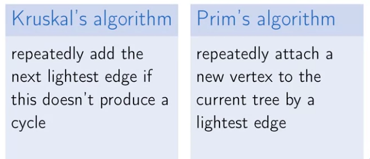
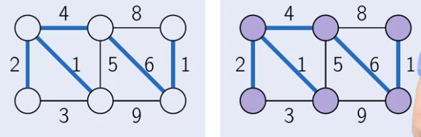
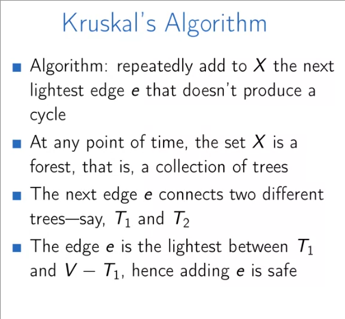
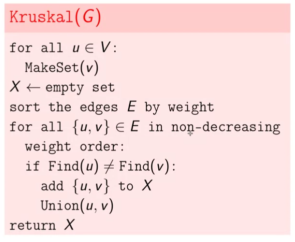
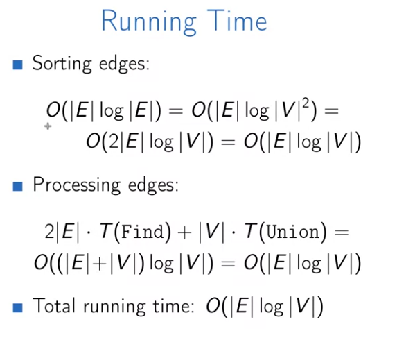

## Minimum Spanning Trees

We are looking for a subset of the edges of a connected graph that **connects all** the vertices together, **without any cycles** and with the **minimum** possible total edge weight.

* Unlike the single source shortest paths, there is no source or destination.

The word tree at minimum spanning tree refers to the fact, each solution of the minimum spanning tree is going to build a tree.

Properties of Trees:

1. A tree is an **undirected** graph that is connected and acyclic.
2. A tree on $n$ vertices has $n-1$ edges.
3. Any **connected** undirected graph $G(V, E)$ with $|E|=|V|-1$ is a tree.
4. An undirected graph is a tree iff there is a unique path between any pair of its vertices.

#### Greedy Algorithms

At the end of this week, we will introduced to two efficient greedy algorithms for the minimum spanning tree problem.

The main idea behind Kruskal and Prim algorithms:

* Prim's and Kruskal's algorithm **works only for undirected graphs**. [Why](https://www.geeksforgeeks.org/why-prims-and-kruskals-mst-algorithm-fails-for-directed-graph/)?
  * Prim’s algorithm **assumes that all vertices are connected**. But in a directed graph, every node is not reachable from every other node, i.e is not connected according to the connected definition inside directed graph. So,  Prim’s algorithm fails due to this reason.
  * Kruskal’s algorithm **fails to detect the cycles in a directed graph** as  there are cases when there is no cycle between the vertices but  Kruskal’s Algorithm assumes it to cycle and don’t take consider some  edges due to which Kruskal’s Algorithm fails for directed graph.

Example: Using the same graph for both of these algorithms and compare the results:

#### Kruskal's Algorithm

Implementation details

1. use **disjoint sets** data structure.
2. initially, each vertex lies in a separate set.
3. each set is a set of vertices of a connected component.
4. to check whether the current edge $\{u,v\}$ produces a cycle, we check whether $u$ and $v$ belong to the same set.

[What is the maximum number of edges in a graph](https://stackoverflow.com/questions/5058406/what-is-the-maximum-number-of-edges-in-a-directed-graph-with-n-nodes) (both directed and undirected).

* Sorted edges:

  $O(|E| \lg{|E|})$ = $O(|E| \lg{|V^2|})$, we used $|V^2|$ because that's the maximum number of edges inside a graph; $O(2|E| \lg{|V|})$ = $O(|E|\lg{|V|})$.

* Processing edges:

  $2|E|.T(Find) + |V| . T(Union)$; we have $2|E|$ as we used two find operation for both edges.

* if we use some sophisticated heuristics such as path compression and etc, the processing edges step will turn into $\lg^*$, but the as the sorted edges takes $O(|E| \lg{|V|})$, it will dominate the second section.

* Kruskal's algorithms' is preferred when the graph is **sparse**, $E=O(V)$, or when the edges can be sorted in linear time.

#### Prim's Algorithm

* X is always a subtree, grows by one edge at each iteration.
* We add a lightest edge between a vertex of the tree and a vertex not in the tree.
* Use a **heap-based** data structure.
* Very similar to Dijkstra's algorithm.
* Prim's algorithm is very similar to Kruskal's: whereas Kruskal's "grows" a forest of trees, Prim's algorithm grows a single tree until it becomes the minimum spanning tree.
* Prim algorithm is preferred when the graph is dense, like $E=O(V^2)$

The running time is:

$|V|.T(ExtractMin) + |E|.T(ChangePriority)$; the total running time depends on the data structure that we use for the queue:

* if it is an **array**, it will be $|V^2|$: $|V|.|V| + |E|.O(1)$ (finding the minimum and shifting the array is costly; while changing the priority is cheap).
* For binary heap-based implementation, the running time is $O(|V| + |E| log |V|)$ = $O(|E| \lg{|V|})$. 

