# Advanced Shortest Paths Project

## Bidirectional Dijkstra

We are given a graph G which can either be directed or undirected but it should have non-negative edge weights.

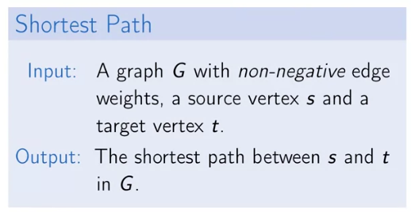

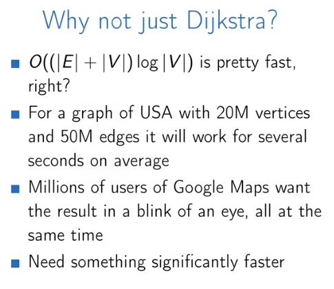

Bidirectional Search means we go both from $s$ forward and also from the destination $t$ backward, until we reach to the same point or one of the searches find the destination.

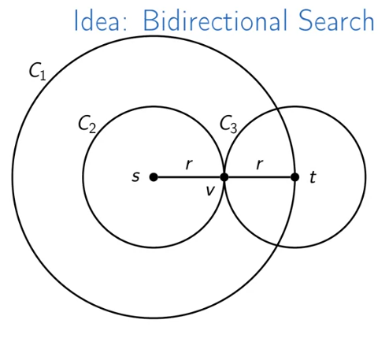

The big circle represents a normal Dijkstra's algorithm, which creates a huge circle area until finds the destination, we can do the same using the bidirectional search which is roughly equal the big circle.

This approach is roughly 2x faster, and this is true for road networks. Bidirectional search idea can reduce the search space.

Now, let's look at social networks: here we had the small world conjecture and also the meet-in-the-middle idea which says instead of searching for all possible objects, search for first halves and for the second halves separately. Meet-in-the-middle runs $\sqrt{n}$ instead of $n$; which is 1000 times faster for social networks.

Extend the Dijkstra's algorithm to be bidirectional

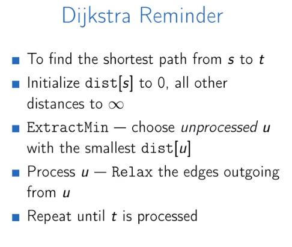

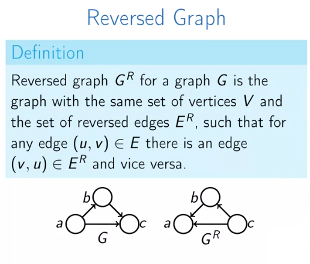

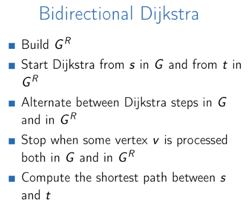

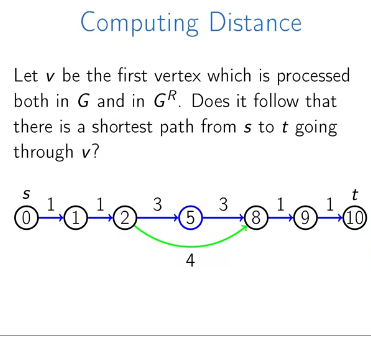

So how we should prevent this problem?

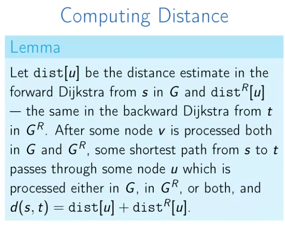

We do the alternate between forward and backward search until at some point $v$ and we remember which vertices are processed in both forward and backward search. Then, for each of those vertices we minimize the sum of distance estimated of forward search and distance estimated of backward search and for the node for which the sum is minimal we know that there is a shortest-path going thorough this vertex and its length is equal to  the sum of these two estimates.

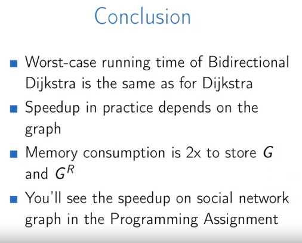

Todos:

- [ ] implement bidirectional search
- [ ] read about [meet-in-the-middle](https://www.youtube.com/watch?v=57SUNQL4JFA)
- [ ] 

## A-start Algorithm (A*)

A-start algorithm will use a heuristic function to estimate whether we're getting close to the destination or not.

We use a potential function $\pi(v)$ which maps vertices to real numbers. This potential function defines new edge weights, but the final shortest path is the same.

* Does any $\pi$ fit us? No, for any edge $(u, v)$, the new length $L_\pi(u,v)$ must be non-negative - such $\pi$ is called **feasible**.

* $\pi(v)$ is an estimation of $d(v, t)$ - "how far is it from here to t?"
* Typically $\pi(v)$ is a lower bound on $d(v,t)$, i.e. on a real map a path from v to t cannot be shorter than the straight lien segment from v to t.
* So, a star is Dijkstra's algorithm with potential function.

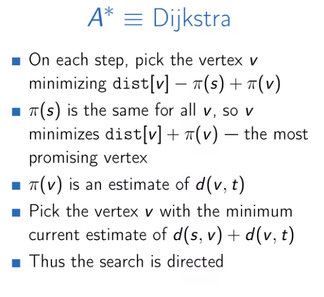

Performance of A*

It all depends on the potential function:

* Worst case: $\pi(v)=0$ for all vertices, the same as Dijkstra.

* Best case: when $\pi(v) = d(v,t)$ for all vertices, in other words, it only visits the edges of shortest $s - t$ paths.
* So, the tighter are the lower bounds, the fewer vertices will be scanned.

Do you think this is enough? No! we can even perform a bidirectional A*, which works even better.

**Bidirectional A***: same as bidirectional Dijkstra, but with potentials. So we need two potential functions. $\pi_f(v)$ which is used inside the forward search $d(v, t)$ and $\pi_r(v)$ estimates $d(s, v)$.

But having two different potential functions could result in two different weights! But for the bidirectional search to work properly we need same weights.

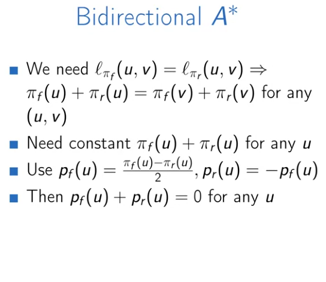

if we could prove the $p_f(u)$ and $p_r(u)$ are feasible then everything works fine.

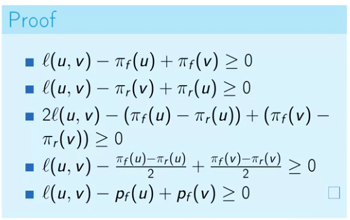

This implementation should be faster than both Bidirectional Dijkstra and A-Star search algorithm.

## Contraction Hierarchies

* Bidirectional Dijkstra can be 1000s of times faster than Dijkstra for social networks. But, just 2x speedup for road networks. So we are looking for a better algorithm for road networks.

* The idea behind this is algorithm is that long-distance trips go through highways. So for a long-distance trip, to get from A to B, first merge into a highway, then into a bigger highway, etc., then exit to a highway, then exit to a street, then go to B.
* Less important roads merge into more important roads, so there is some hierarchy of roads.
* There are algorithms based on this idea, such as "**Highway Hierarchies**" and "**Transit Node Routing**", they can be millions of times faster than a classical Dijkstra. But as those algorithms tend to be complex we focus on 'Contraction Hierarchies' which is thousands of times faster than Dijkstra.

Node Ordering: Nodes can be ordered by some importance, importance first increases then decreases back along any shortest path, for instance, points where a highway merges into another highway. Then we can use a bidirectional search.

​											 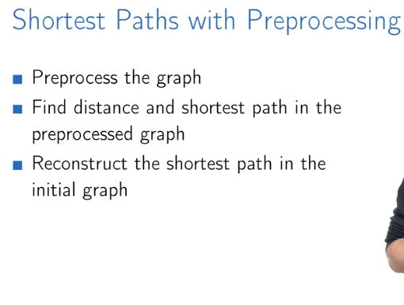

Preprocessing

​													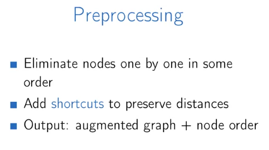

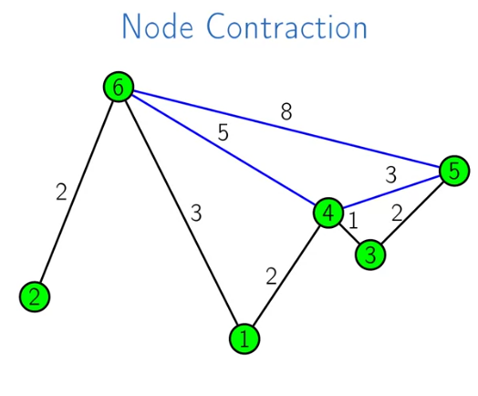

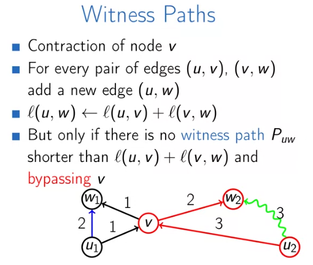

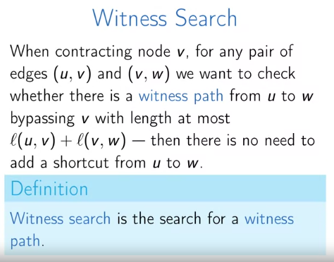

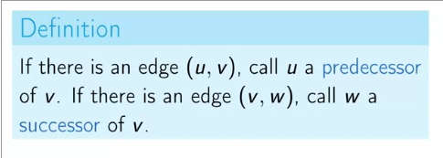

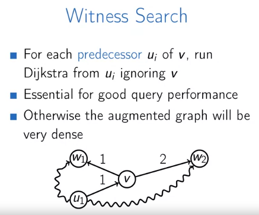

As this approach might take a very long time, we need some optimizations to make it faster:

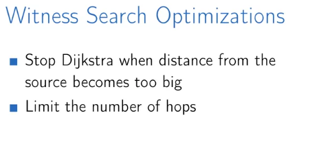

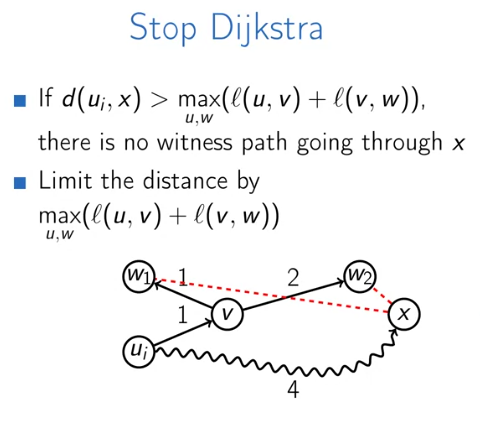

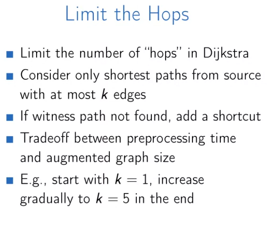

How to find distance between nodes in the augmented graph:

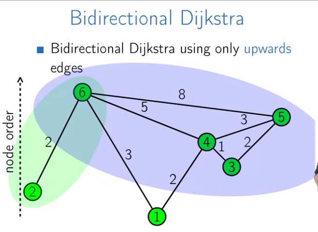

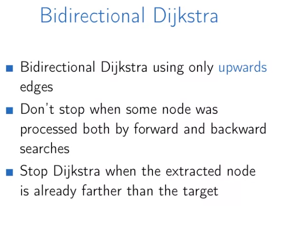

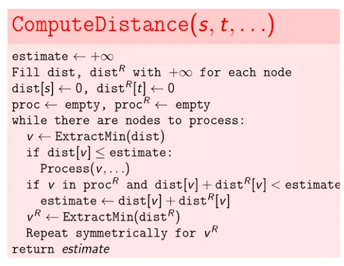