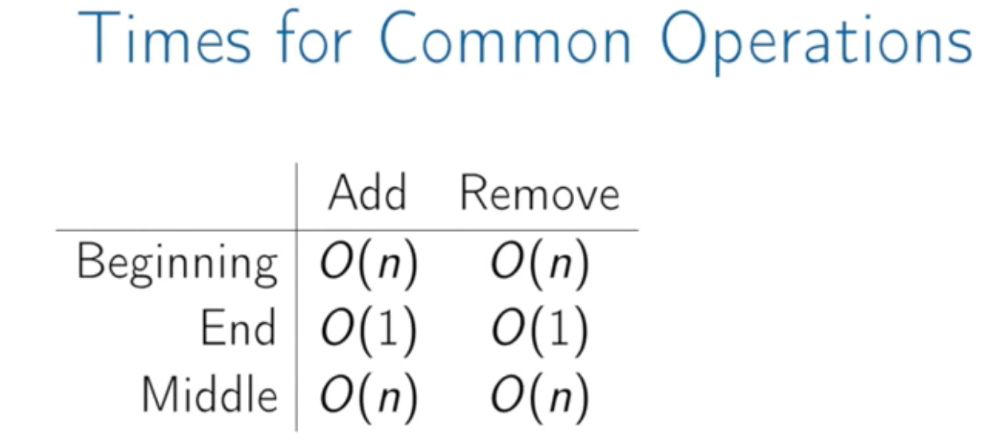
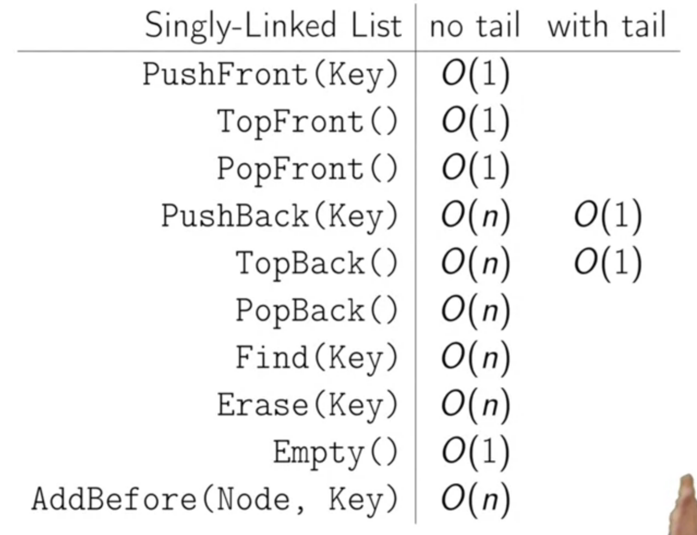
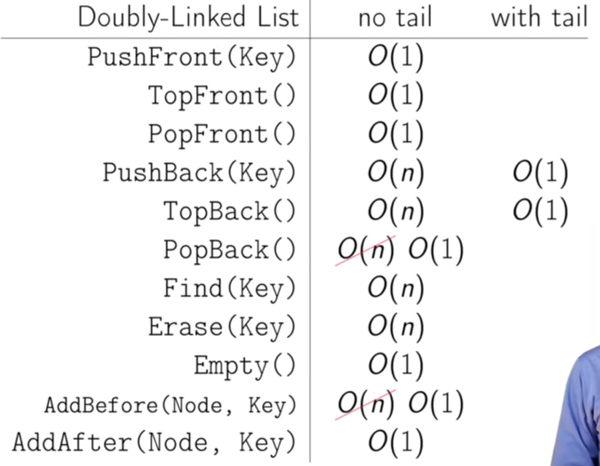

# Week 1

## Arrays and Linked Lists

### Array

There are two ways to store arrays in memory, namely row-major and column-major.

Array's items can be accessed in $$O(1)$$ using the following formula:

$$array\_addr + element\_size * (i - start\_index)$$



### Linked lists

Arrays have the following limitations:

1. The size of the arrays is fixed.
2.  Inserting at the beginning or middle of the array is expensive.

Advantages of Linked lists over arrays:

* Dynamic size
* Ease of insertion/deletion

Drawbacks:

* Random access is not allowed. You should access them sequentially.
* Extra memory for pointers

Each node in a list consists of at least two parts:

1. Data
2. Pointer



#### Doubly-Linked-list

We can solve previous $$O(n)$$ operations using two pointers, so each node contains:

1. Key
2. next Pointer
3. previous Pointer

Before adding the tail pointer all front actions were cheap but the operations that were dealing with the tail were pretty expensive. After adding tail everything was except for Pop back which takes $$O(n)$$. When we switch to doubly-linked-list popback and add_before operations become $$O(1)$$.



[Link to this week slides](https://d3c33hcgiwev3.cloudfront.net/_52e80f34296ebf21912ca201cabebef8_05_1_arrays_and_lists.pdf?Expires=1617321600&Signature=Hcrvg9eeJCR59NdOPpeBxtQ0deBwASOWxYA4fnbFxEA~2jdtlkZDDXO5DTfb7FhJdLM8UsCXrVJJZnfuKW1~oPGIjHNi9nl27VXC3nkmPVtQBjVi~vtUui8EP2vHhLoGZ5woyTYbcZfwqLDofEjFFbrJfqUkeUNS36ShwDAAoro_&Key-Pair-Id=APKAJLTNE6QMUY6HBC5A)

## Stacks and Queues

Stack (LIFO) can be implemented with either an array or a linked-list. The array might have a fixed-size limitation, on the other hand, with linked-list you're free to add as many as you want.

```python
class Stack:
    def push(self, item):
        pass
    
    def pop(self):
        pass
    
    @property
    def top(self):
        pass
    
    @property
    def is_empty(self):
        pass
```

Queue (FIFO)

Queues can be implemented with either a **linked-list** (with tail pointer) or an **array**. Remember, each queue operation should be $$O(1)$$.

```python
class Queue:
    def enqueue(self, item):
        """Add a given item into the container."""

    def dequeue(self):
        """Remove and return the least recently-dded key."""
	@property
	def is_empty(self) -> bool:
        pass
```

## Trees

A Tree is:

* empty, or
* a node with:
  * a key, and
  * a list of child trees.

A Node in tree contains:

* Key
* Children: List of children nodes
* (Optional) parent

For binary tree: node contains:

* key
* left
* right
* (optional) parent

### Tree Traversal

There are two main ways to traverse a tree:

1. Depth-first: We completely traverse one sub-tree before exploring a sibling sub-tree.

   ```python
   def inorder_traversal(tree: Tree):
       """It only makes sense in binary search tree."""
       if len(tree) < 1:
           return None
       inorder_traversal(tree.left)
       print(tree.key)
       inorder_traversal(tree.right)
   
   def preorder_traversal(tree):
       """
       Preorder and Postorder make sense for any
       kind of trees.
       """
       if len(tree) < 1:
           return None
       print(tree.key)
       preorder_traversal(tree.left)
       preorder_traversal(tree.right)
   
   def postorder_traversal(tree):
       if len(tree) < 1:
           return None
       
   ```

2. Breadth-first: we traverse all nodes at one level before progressing to the next level.

