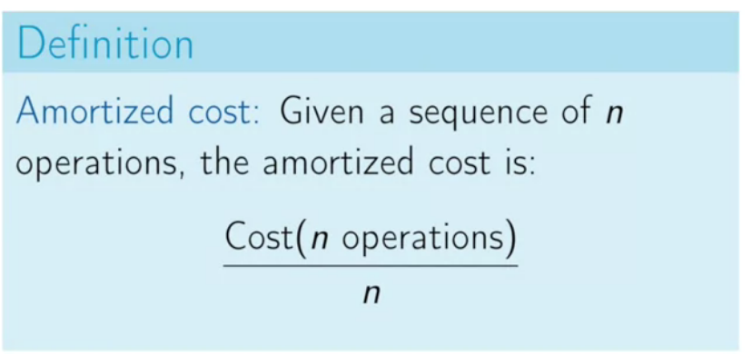
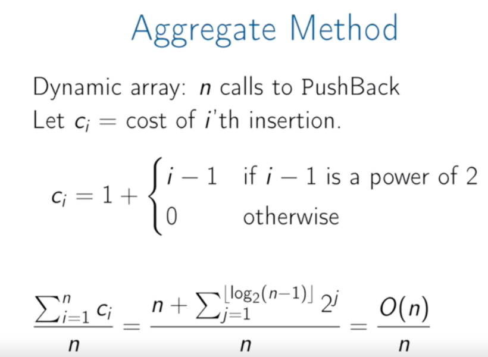

# Dynamic Array

Working with static array can be a little bit challenging, in order to solve this we will dynamic array, in this scenario we will keep a **pointer** to the array, when we need more rooms, we can create a new array with more space and then simply update the pointer to the newly-allocated array.

Implementation:

* array: dynamically-allocated array
* capacity: size of the dynamically-allocated array.
* size: number of elements currently in the array.

**Summary**

Unlike static arrays, dynamic arrays can be resized.

Appending a new element to a dynamic array is often *constant time*, but can take $$O(n)$$. 

https://brilliant.org/wiki/amortized-analysis/

## Aggregate method

Generally speaking, we say push-back operation in dynamic array is $$O(1)$$ because of the amortized analysis (Aggregate method).
$$
\frac{n*\Theta(1) + 1 * \Theta(n)}{n+1}
$$

## Banker's method