# Priority Queue

A priority queue is a generalization of a queue where each element is assigned a priority and elements come out in order by priority.

Algorithms that use priority queue:

* Dijsktra's algorithm: finding a shortest path in graph
* Prim's algorithm: constructing a minimum spanning tree of a graph
* Huffman's algorithm: constructing an optimum prefix-free encoding of a string
* Heap sort: sorting a given sequence

Python libraries for priority queue:

[heapq](https://docs.python.org/3/library/heapq.html)

[Priority Queue](https://docs.python.org/3/library/queue.html#queue.PriorityQueue)

Analyzing the naive ideas:

1. Unsorted Array: in this implementation, it requires $$O(1)$$ to insert the item, but for retrieving the max element it takes $$O(n)$$.

2. Sorted Array:

   1. insertion: finding the right position using binary search $$O(\lg n)$$ and insertion (shift) itself takes $$O(n)$$.
   2. extraction the max element: $$O(1)$$

3. Sorted List (linked list):

   1. extraction: $$O(1)$$
   2. insertion: we cannot use binary search here! $$O(n)$$

   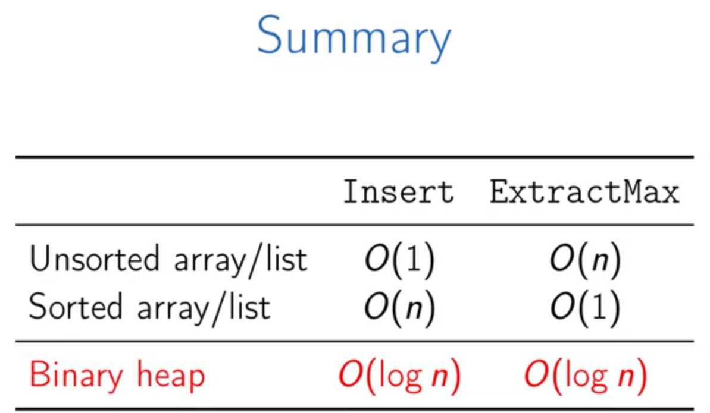

## Priority Queue using heaps

Binary max heap: is a binary tree (binary means at most has two children) where the value of each node is at least the values of its children, i.e. it is $$>=$$ of its children.

### Heap operations

* **Finding the max value** requires no effort as it is the root of the tree $$O(1)$$.
* **Insert**: we cannot directly attach the new node to root, so we start with one of the leaves, and if the recently added node is larger than its root, we should fix this problem which is called **sift-up** process, *we swap the problematic node with its parent until the problem is satisfied*. At the worst case it requires $$O(tree\ height)$$.
* **Extract max**: we replace the root with any leaf, and then we have to make sure the new change does not the break the max-heap properties or we need to do a **sift-down** process. *We swap the problematic node with larger child until the heap property is satisfied*. The running time of this procedure is $$O(tree\ height)$$.
* **Change Priority**: Now that we have both sift-up and sift-down we can provide a simply method for change an existed node priority and fix the possible problems using sift-up and sift-down. Running time $$O(tree\ height)$$.
* **Remove**: change a given node priority to a large value such as $$+\infty$$ and then use the **extract max** method. running time: $$O(tree\ height)$$.

* As all operations on tree's height, we like to keep the tree **shallow** as much as possible.

How to keep a tree shallow?

* **Using a complete binary tree**. A binary tree is **complete** if all its level are filled except possibly the last one which is filled from *left to right*. 

* **Advantages** of **complete** binary trees?

  1. A complete binary tree with $$n$$ nodes has height at most $$O(\lg n)$$.
  2. It can be stored as an **array** (efficient), we need no pointers!

  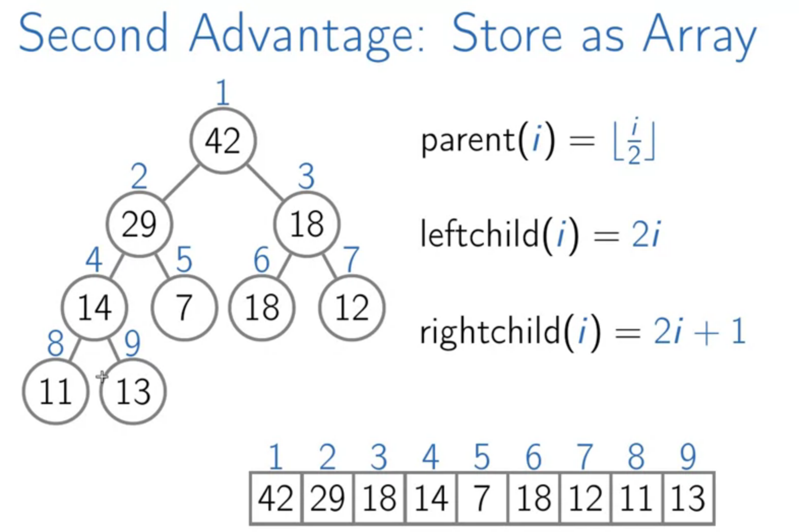

* Is there any **downside**? **Yes, we need to keep the tree complete**! What operations could modify the shape of the tree?

  * **Insert**: to solve the problem with the insert method, we should insert the element in the **left-most vacant position in the last level** and then sift-up.
  * **extract-max**: to extract the max value, replace the root by the last leaf and then do the sift-down process.

### Pseudo code (MaxHeap)

[Example code for MinHeap](https://www.educative.io/edpresso/heap-implementation-in-python)

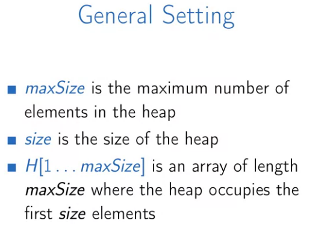

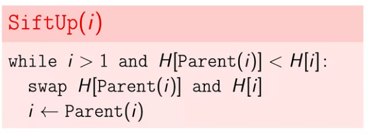

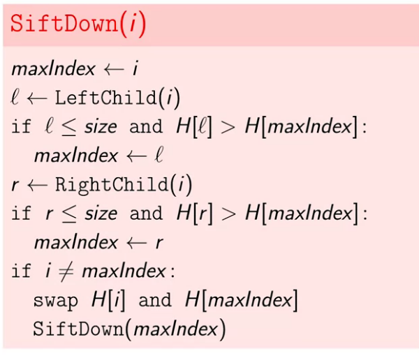

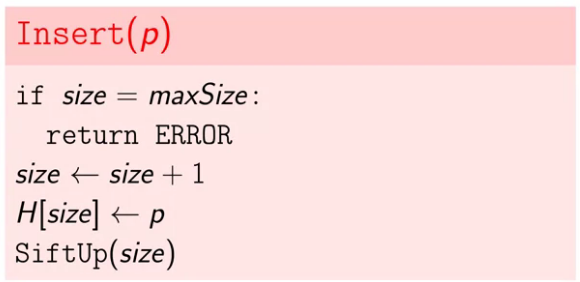

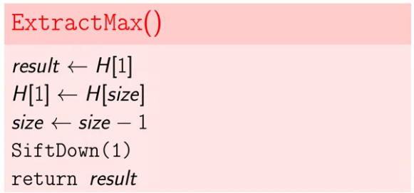

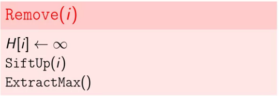

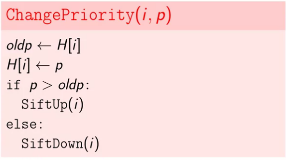

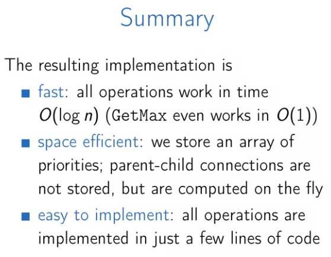

## Heap Sort

We will use binary heap to design heap sort algorithm which is fast and efficient sorting algorithm. We can use priority queue to handle the heap sort algorithm such as following:

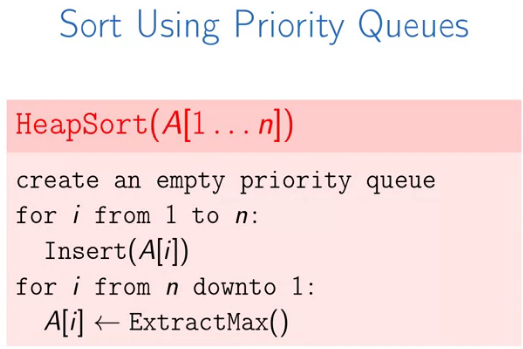

* The resulting algorithm is comparison-based and has running time $$O(n \lg n)$$.
* Heap sort is a natural generalization of selection sort: instead of simply scanning test rest of the array to find maximum value, use a smart data structure.
* **Problem**: We are using **additional space** to store the priority queue.

*In-place heap sort algorithm is possible*. For this, we will first turn a give array into a heap by permuting its elements.

Turn an array into a heap:

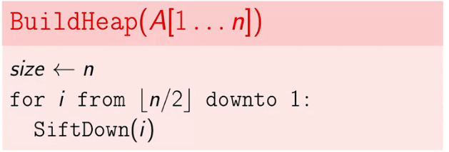

* We repair the heap property going from bottom to top, running time: $$O(n \lg n)$$.

In-place Heap Sort(change the array into an increasing order):

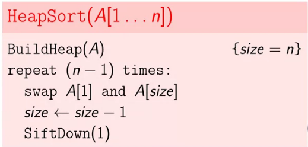

* It is in-place, we don't need additional space.
* It is efficient, even in the worst-case is $$O(n \lg n)$$.

#### Building a Heap running time

* The running time of `BuildHeap` is $$O(n \lg n)$$ since we call `SiftDown` for $$O(n)$$ nodes ($$O(\frac{n}{2}.\lg n)$$).
* If a node is already close to the leaves the sifting it down is fast. And we have many such nodes! The question is was our estimation of the running time of `BuildHeap` too pessimistic?

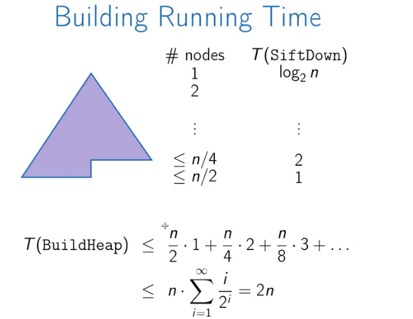

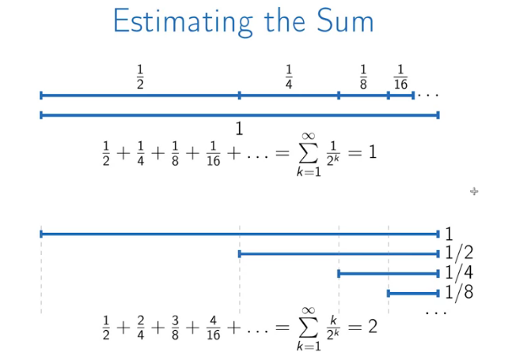

* This new insight does not change the running time of heap sort, as we have to do $$n - 1$$ `extract_max` operations. However, this helps to solve another problem faster, k largest or k smallest, this problem can be solved in $$O(n)$$ if $$k \leq \frac{n}{\lg n}$$. Because we first have to create a heap in $$O(n)$$ then we need to do k extract_max method:

  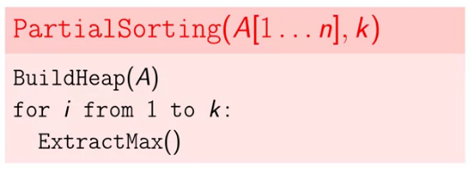

Running time: $$O(n + k \lg n)$$, if $$k \leq \frac{n}{\lg n}$$ then the running time is $$O(n)$$.

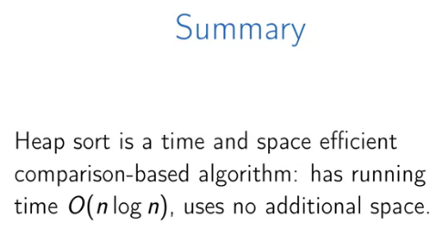

For implementing a binary heap using zero-based array we can use the following formula:

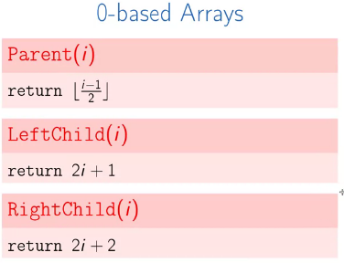

Binary Min-Heap can be used when we want to extract an item with minimum priority not its maximum:

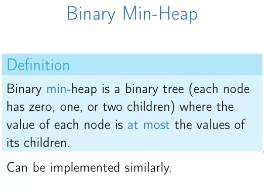