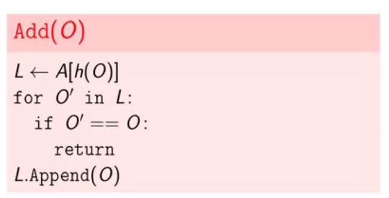

# Hashing

Convert an IP Address to 32-bit integer number:

```python
ip_address = "192.168.1.100"
def ip_to_int(ip_address):
    octeds = list(map(int, ip_address.split(".")))
    # return octeds[3] | octeds[2] << 8 | octeds[1] << 16 | octeds[0] << 24
    return octeds[0] * 2**24 + octeds[1] * 2 ** 16 + octeds[2] * 2 ** 8 + octeds[3]
```

A hash function receives an input and it generates a number between 0 and $$m - 1$$. So $$m$$ is the **cardinality** of the the hash-function, i.e. m is the number of elements that this set can hold.

## Chaining Technique

Hash tables in our case study has three important methods:

* HasKey
* Get
* Set


Because collision can happen for two objects and as we use **chaining** technique, then the running time or operation in hash table depends on number of items exists in a retrieved list $$\Theta(c + 1)$$:


A **set** is just a hash table which only holds keys not values, and has three methods: add, remove, find.





* Chaining is a technique to implement a hash table.
* Memory consumption is $$O(n + m)$$, $$n$$ is the number pairs inside the array.
* Operations work in $$O(c + 1)$$ where $$c$$ is the longest chain.
* How to make both $$c$$ and $$m$$ small?

### Hash functions

* Hash functions should be **deterministic**, this means we cannot use random values despite its good characteristics, such as uniformity.
* **Fast** to compute.
* **Distributes** keys **well** into different cells.
* **Few collisions**.

* $$\alpha$$ or *load factor* is $$\frac{n}{m}$$, which measures how filled up is our hash table.

* We want to have small $$m$$ to use less memory and small $$c$$ to have an efficient search.


In order to prevent collisions we're gonna use this approach:

Similar to the quick sort pivot selection which was random, we desire to have randomness but we must be deterministic at the same time. So we define a set of hash functions which called **universal family** and we randomly choose one of them.


How this new idea is going to help us? Well, we say the collisions are acceptable if the probability of the collision for two different values among hash functions  is below $$\frac{1}{m}$$, i.e. it means we don't have collisions in $$1-\frac{1}{m}$$.

* $$h$$ is chosen randomly from a universe family.


Second problem is choosing a value for hash table size, we want to keep our hash table not too crowded as it impacts the performance of the hash table. and operations will happen in $$O(1 + a)$$.


Making the hash table size static will severely impact the hash table performance. We need to use the same idea we had in the dynamic array, this time however, we're gonna double the hash table size whenever we hit the a certain $$a$$.


In this case, we will double the hash table size and choose a new hash function which matches hash table cardinality and compute the hash of each value and then insert it inside the new hash table.


* You should call `Rehash` after each operation with the hash table. Similarly to dynamic arrays, single rehashing takes $$O(n)$$ time, but the amortized running time of each operation with hash table is still $$O(1)$$ on average, because rehashing will be rare.

#### Hashing Integers

Now, we need to create a universal family hash functions, and inside it we will have a hash functions for most of important objects, such as integers and strings.

1. Choose prime number bigger than your data range, for example in our case we needed to save $$10^7$$, $$p=10\ 000\ 019 $$, $$m=10$$.


The size of this hash family is $$p(p-1)$$, because a hash $p-1$ allowed values and $b$ has $p$ values, and they are independent.


In summary:


#### Hash strings

For our use case, phone book, we need to implement a map from users to phone numbers. We need a hash function defined on names.


* The size this hash function is $p-1$ as x could have $p-1$ values.

Implementation:


For any $a,b$ and $p$ the following properties of module arithmetics are true:

1. $(a + b)\ mod\ p) mod\ p = (a + b) mod\ p$
2. $$(a\ mod\ p) b\ mod\ p = ab\ mod\ p$$


Efficiency of our algorithm:

