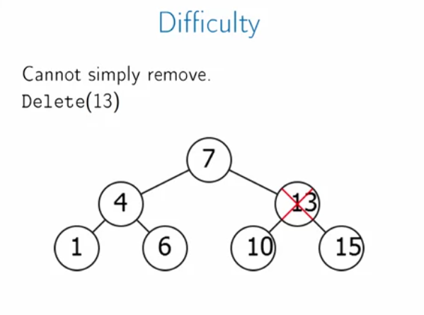

# Week 5

## Binary Search Trees

### Intro

Problems that we can solve using binary search trees:

* Dictionary Search: find all words that start with some given string.
* Date ranges: find all emails received in a given period.
* Closest height: find the person in your class whose height is closet to yours.

Local search is something that all of these problems have in common, operations that wee need are `RangeSearch` and `NearestNeighbors` and we also need `insert` and `delete` operations to keep it dynamic.

* None of the existing data structures work for us (hash table, unsorted array), but sorted arrays can search efficiently but not update.

### Basic operations

* Search tree helps us to work exactly like binary search. In search trees the left subtree has smaller keys, while the right subtree has bigger keys.

Basic operations:

* **Find**: if the item is not present in the tree, we can find a proper place to insert this item in the tree.

  

* **Next** Element or adjacent node: given a node N in a binary search tree, would like to find adjacent element; if you have right child then go and find the leftmost item, which is closer to N than any item. If it has no right child, then you go up, and up until you find the bigger ancestor which is bigger than $N$. 

​	

	

* **Search**, `RangeSearch(x, y)`: a list of nodes with key between $x$ and $y$.

  

  

* **Insert**: adds node with key $k$ to the tree. Here, we can use a modified version of **find** function to find the appropriate place to put the key.

* **Delete**: removes node $N$ from the tree. Before you remove you should find the **closest** item which we expect it to be the leftmost node in the right subtree:

  

### Runtime and time complexity

How long do Binary Search Tree operations take?

* Find $O(Depth)$

  

  * But depth can be as bad as $n$.

    

  * If we rearrange the tree with the same nodes, the depth can be smaller as well:

    

* Our goal is the left and right subtrees to have approximately the same size (**Balance**). Suppose it is perfectly balanced:

  * each subtree half the size of its parent.
  * after $log_2(n)$ levels, subtree of size 1.
  * operations run in $O(\lg n)$ time.

- Problem: Insertions and deletions can destroy balance! So, somehow we need a way to fix this problem, like **rearrange tree to maintain balance**.
- Problem: How do we rearrange tee while maintaining order? Idea: **Rotations**

* **How to keep a tree balanced? AVL trees!**

## AVL Trees

### Intro

We learned that in order to our search operations be fast we need to find a way to balance the tree. But before that we need a way to measure balance tree.

For that purpose we need to calculate the height of the tree:

The way we calculate the height of the tree:

* In order to reduce the computational cost we **save the height as an attribute on each node**:

* So our measure to understand whether the tree is balanced or not is the height of each subtree. We'd say the tree is balanced iff:

* Need to show that AVL property implies $Height=O(\lg(n))$. Alternatively, show that large height implies many nodes.

### Implementation

There two places that we need to take care of our balanced tree:

* insertion
* deletion

We need a new insertion algorithm that involves rebalancing the tree to maintain the AVL property.

The basic idea of inserting is like this: 

* Firstly, we'd insert the node as before, then find that node in the tree and then run a rebalanced on the tree.

How would we do the rebalancing? first if the $|N.left.height - N.right.height| <= 1$ , then it is fine and we don't need to do anything. but if it differs with more than one, the we'd do the rebalancing:

The `AdjuctHeight` function is pretty simple, we just calculate the height again:

**Delete** operation: before we delete it, we found its successor, its successor probably isn't going to have a left child but it might have a right child. We take this successor and replace it with the node we are gonna to delete and the successor's right child replaces it. And we need to adjust the height of the successor parent to fix the height of the tree.

Binary Search Trees have more interesting features such as you can recombine them, two new operations:

* Merge: combine two binary search trees into a single one.
* Split: break one binary search tree into two

#### Merge

In general, to merge two sorted lists takes $O(n)$ time. However, when they are separated it is faster:

In merge operation we are given two roots $R_1, R_1$ with all keys in $R_1$'s tree smaller than those in $R_2$'s.