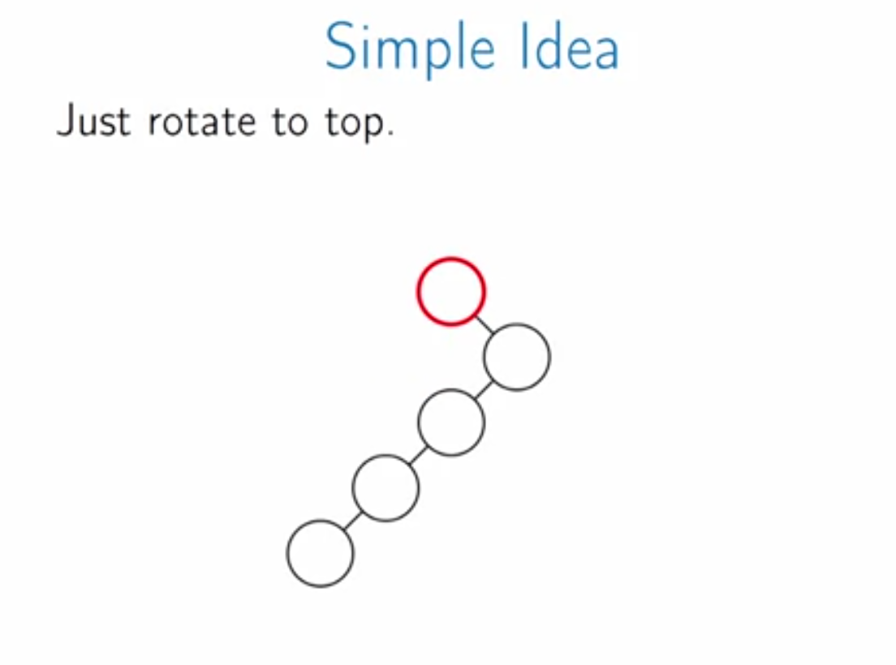

# Splay Trees

Until now, we talk about how to keep our tree balanced in order to have operations in $O(\lg n)$., in other words, search for random access is at least $O(\lg n)$.

However, if some items are searched more frequent than other, probably you can do better, by putting the frequently items close to the root.

Problem: What if we have some elements that we frequently search for them:

For example, in the above picture, if we search for 1, 5, 7 items more so often, then it is better to use the unbalanced tree.

* So the idea is that we **want common nodes near root** and we don't know which those node will be.
* Simple idea: **bring the queried node to the root**:

Unfortunately the simple idea is not that good, we start with an unbalanced tree and ended up with imbalanced one as well. In fact, it is possible to repeat the operations over and over again, which takes $O(n^2)$. So **the average operation time is linear rather than logarithmic**.

We are going to modify the simple idea in a way that it looks at a node, its parent and also its grandparent. And they are few cases that we need to take care of:

1. The first one is **zig-zig** when the node and its parent and its grand-parent are on the same side:

2. Another case is when the parent and the grand parent are on the opposite side (**zig-zag** or also known as left-right rotation):

3. Finally, there is a case when a node only has a parent, there is no grand parent, what we do is just simply rotate it with its parent:

### Splay operation

We add a new operation to the binary search trees, which is called splay operation which tries to bring a node to the root of the tree. We keeps splay until the the node is root.

### Splay Trees Implementation

So far, splay operation does not guarantee to keep the tree balanced. How to solve this problem:

Delete is also easy if we bring both a node and its successor to the root:

Code for delete:

* There is one special case what if n is the largest element, and there is no successor?

Split is also very nice with Splay trees, the point is there is one case that the split is very easy and that's when n is the root, and with the splay trees it is easy to make any node the root that we want:

* search the place that we want to make our split
* bring that node to the tree's root and split it into two.

Merge is pretty simple because we will bring the largest element of first tree to root and sick second tree as child of the root:

In summary, in splay trees all operations are simply in $O(\lg n)$, amortized time.
